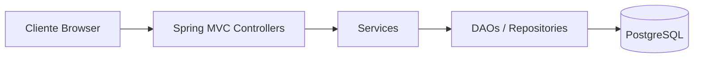
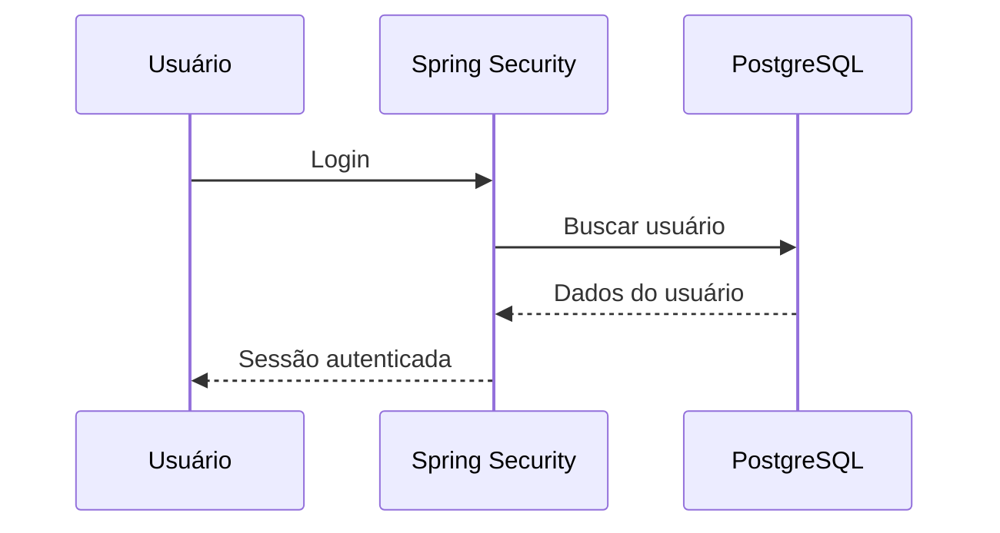
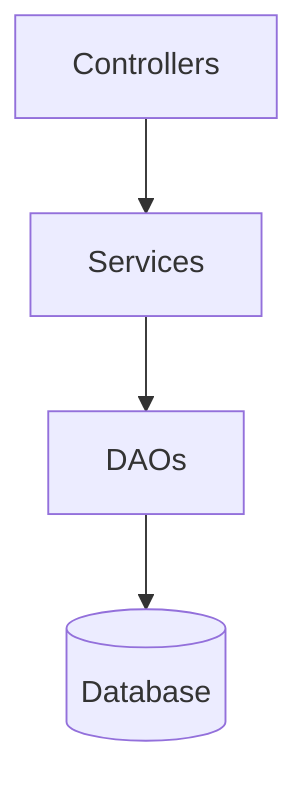
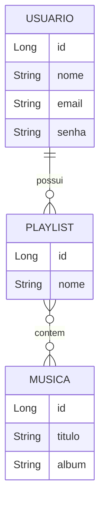

# SiteLinkinPark - Linkin Park: De Fã para Fã


---

# 📋 Sumário

- Visão Geral
- Funcionalidades
- Arquitetura
- Modelo de Camadas
- Tecnologias
- Estrutura do Projeto
- Segurança
- Banco de Dados
- Instalação
- Execução
- Docker
- Roadmap

---

# 🚀 Visão Geral

O SiteLinkinPark é um projeto acadêmico desenvolvido para a disciplina **Desenvolvimento para Servidores II** do curso **Sistemas para Internet** da **Fatec Rubens Lara**.

O objetivo é disponibilizar uma plataforma para fãs da banda Linkin Park contendo:

- Informações sobre integrantes.
- Catálogo de músicas.
- Gerenciamento de playlists.
- Cadastro e autenticação de usuários.
- Área administrativa.

---

## Funcionalidades

## Área Pública

- Página inicial com biografia da banda Linkin Park.
- Integrantes originais.
- Integrantes atuais.
- Navegação responsiva.

## Usuários Autenticados

- Cadastro.
- Login.
- Logout.
- Perfil do usuário.
- Atualização de dados.
- Exclusão de conta.
- Criação de playlists.
- Edição de playlists.
- Remoção de músicas.
- Exclusão de playlists.

## Administração

- Controle de acesso por Role.
- Cadastro de músicas.
- Bootstrap de administrador.

---

# 🏗 Arquitetura

## Arquitetura Geral



---

## Fluxo de Autenticação



---

## Camadas da Aplicação



---

# 🧰 Tecnologias Utilizadas

## Backend

- Java 21
- Spring Boot
- Spring MVC
- Spring Security
- Spring Validation
- Spring Session JDBC

## Frontend

- Thymeleaf
- Bootstrap
- HTML5
- CSS3

## Banco

- PostgreSQL

## DevOps

- Docker
- Maven Wrapper

---

# 📂 Estrutura do Projeto

```text
src/main/java/com/example/SiteLinkinPark
│
├── config
│   ├── SecurityConfig
│   ├── CustomUserDetailsService
│   ├── AdminBootstrap
│   └── GlobalExceptionHandler
│
├── controller
│   ├── MenuController
│   ├── UsuarioController
│   ├── MusicaController
│   └── PlaylistController
│
├── model
│   ├── Usuario
│   ├── Musica
│   ├── Playlist
│   ├── DAO
│   └── Service
│
└── SiteLinkinParkApplication
```

---

# 🔒 Segurança

O projeto utiliza Spring Security com:

- BCrypt Password Encoder.
- Controle de acesso por Roles.
- Sessões JDBC.
- CustomUserDetailsService.
- Rotas administrativas protegidas.

### Perfis

| Perfil | Permissões |
|----------|------------|
| USER | Operações comuns |
| ADMIN | Gerenciamento de músicas |

---

# 🗄 Banco de Dados

Entidades principais:



---

# ⚙️ Configuração

Configure as credenciais do banco por variáveis de ambiente.

```properties
spring.datasource.url=${DATABASE_URL}
spring.datasource.username=${DATABASE_USERNAME}
spring.datasource.password=${DATABASE_PASSWORD}
```
---

# ▶️ Execução

## Rodar localmente

```bash
./mvnw spring-boot:run
```

## Gerar build

```bash
./mvnw clean package
```

---

# 📌 Estado Atual

## Concluído

- Sistema de autenticação.
- CRUD de usuários.
- CRUD de playlists.
- Catálogo de músicas.
- Área administrativa.
- PostgreSQL.
- Thymeleaf.
- Docker.

---

# 👨‍💻 Autor
**Kauê de Oliveira Martins**
Projeto acadêmico desenvolvido para fins educacionais.

---

## 📄 Licença

Uso acadêmico e educacional.